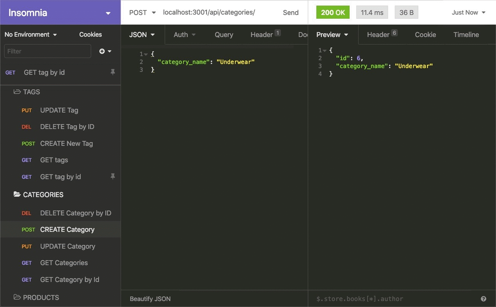

# E-Commerce Back End

## Description

This application is the back end for an e-commerce site that was created by modifying starter code. It was developed by configuring a working Express.js API to use Sequelize to interact with a MySQL database.

## User Story

```md
AS A manager at an internet retail company
I WANT a back end for my e-commerce website that uses the latest technologies
SO THAT my company can compete with other e-commerce companies
```

## Features

- Functional Express.js API that allows the user to enter a database name, MySQL username, and MySQL password to an environment variable file
- Connection to a database using Sequelize that responds to schema and seed commands
- A development database is created and is seeded with test data when the user enters the command to invoke the application
- The server starts and the Sequelize models are synced to the MySQL database
- When the user opens API GET routes in Insomnia for categories, products, or tags, the data for each of these routes is displayed in a formatted JSON
- When the user tests API POST, PUT, and DELETE routes in Insomnia, they are able to successfully create, update, and delete data in the database


## Mock-Up

The following animation shows the application's GET routes to return all categories, all products, and all tags being tested in Insomnia:


The following animation shows the application's GET routes to return a single category, a single product, and a single tag being tested in Insomnia:


The following animation shows the application's POST, PUT, and DELETE routes for categories being tested in Insomnia:



Your walkthrough video should also show the POST, PUT, and DELETE routes for products and tags being tested in Insomnia.

## Walkthrough Video

https://drive.google.com/file/d/1SGNTJewl_aVsJ2sHN9ii2HM3OOPuWu-d/view
